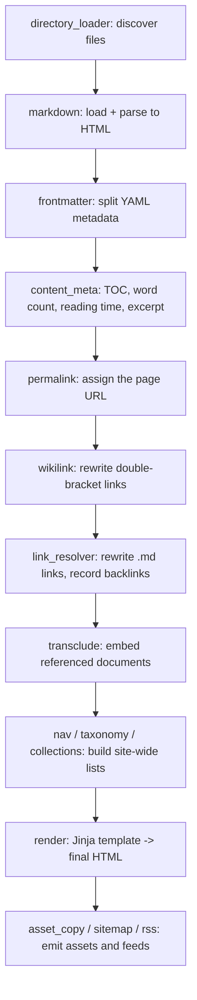

# The plugin pipeline

This page explains how a single Markdown file becomes an HTML page, and the hook
system that orchestrates it.

## Phases

Every node moves through an ordered set of **phases**. The phase enum is, in
order:

`LOAD -> PARSE -> RESOLVE -> COLLECT -> GENERATE -> RENDER -> OPTIMIZE -> EMIT`

Phases give the work a deterministic spine. The full build and the incremental
rebuild run the *same* per-node and per-page processing through these phases - the
full build simply marks everything dirty from `LOAD`, while the incremental path
seeds a worklist from filesystem events and converges to the same result.

## Hooks

Within and around the phases, plugins attach to **hooks**. A hook is a typed
extension point; PySSG borrows four flavors from tapable, each with a different
value-flow semantic:

- **SyncHook** - call every tap for its side effects.
- **AsyncSeriesHook** - await each tap in turn (used for I/O like emitting files).
- **WaterfallHook** - thread a value through the taps; each returns the next input
  (used for content rewrites: `finalize_content`, `route`, `render_page`).
- **BailHook** - stop at the first tap that returns a non-`None` value (used for
  "who can load this?" / "who can resolve this link?").

Taps declare *relative* order with a coarse `stage` integer plus `before` /
`after` name constraints. Before each call the taps are topologically sorted, so
order is deterministic and a constraint cycle is reported as `HookOrderError`
rather than producing a silently wrong build.

## The journey of a Markdown file

Here is the path a `content/guide/intro.md` file takes, and which built-in plugin
owns each step:

Two scopes of hooks make this work:

- **Builder hooks** run once around the whole session. `make` is where a plugin
  can *inject* nodes that have no source file - this is exactly how `apidoc` adds
  its synthetic reference documents to the graph.
- **Build hooks** run per compilation. The interesting rewrite hooks are
  waterfalls: `finalize_content` (wikilink at stage 100, link resolution at 200,
  `external_links` at 300), then `expand_content` for transclusion, then `route`
  to assign URLs, then `render_page` for the final HTML.

## The `route` contract

The `route` hook deserves a special mention: a `route` tap that returns the empty
string `""` means **"no page"** - the permalink generator emits nothing for that
document. Plugins use this to suppress output; for example, the `i18n` plugin
drops any document that is not inside a configured locale directory.

## Why this shape

Because each step is a small tap on a typed hook, you can add behaviour without
touching the core (see [Write a custom plugin](../how-to/write-a-plugin.md)), and
the engine can reason about ordering and dirtiness uniformly. The plugins only
ever *declare facts*; the algorithms that turn those facts into a correct,
incremental build stay in the core.
