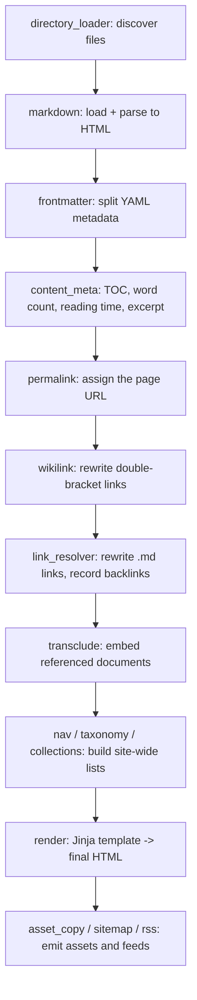

# Pipeline plugin

Trang này giải thích cách một file Markdown đơn lẻ trở thành một trang HTML, và hệ
thống hook điều phối quá trình đó.

## Các pha (phase)

Mỗi node đi qua một tập **pha** có thứ tự. Enum pha, theo thứ tự, là:

`LOAD -> PARSE -> RESOLVE -> COLLECT -> GENERATE -> RENDER -> OPTIMIZE -> EMIT`

Các pha tạo nên một bộ khung tất định cho công việc. Build đầy đủ và build tăng
tiến chạy *cùng* một quy trình xử lý theo từng node và từng trang qua các pha này -
build đầy đủ đơn giản đánh dấu mọi thứ "bẩn" từ `LOAD`, trong khi đường tăng tiến
gieo một danh sách công việc từ các sự kiện hệ thống tệp và hội tụ về cùng kết quả.

## Hook

Bên trong và xung quanh các pha, plugin gắn vào các **hook**. Một hook là một điểm
mở rộng có kiểu; PySSG mượn bốn "vị" từ tapable, mỗi vị có một ngữ nghĩa luồng giá
trị khác nhau:

- **SyncHook** - gọi mọi tap để lấy hiệu ứng phụ.
- **AsyncSeriesHook** - await từng tap lần lượt (dùng cho I/O như ghi file).
- **WaterfallHook** - luồn một giá trị qua các tap; mỗi tap trả về đầu vào tiếp
  theo (dùng cho viết lại nội dung: `finalize_content`, `route`, `render_page`).
- **BailHook** - dừng ở tap đầu tiên trả về giá trị khác `None` (dùng cho "ai có
  thể load cái này?" / "ai có thể phân giải liên kết này?").

Các tap khai báo thứ tự *tương đối* bằng một số nguyên `stage` thô cùng ràng buộc
tên `before` / `after`. Trước mỗi lần gọi, các tap được sắp xếp theo thứ tự tô-pô,
nên thứ tự là tất định và một ràng buộc tạo vòng lặp được báo là `HookOrderError`
thay vì âm thầm tạo ra một bản build sai.

## Hành trình của một file Markdown

Dưới đây là đường đi của một file `content/guide/intro.md`, và plugin tích hợp nào
sở hữu mỗi bước:

Hai phạm vi hook làm cho điều này hoạt động:

- **Builder hook** chạy một lần quanh cả phiên. `make` là nơi một plugin có thể
  *chèn* các node không có file nguồn - đây chính là cách `apidoc` thêm các tài
  liệu reference tổng hợp của nó vào đồ thị.
- **Build hook** chạy theo từng lần biên dịch. Các hook viết lại thú vị là dạng
  waterfall: `finalize_content` (wikilink ở stage 100, phân giải liên kết ở 200,
  `external_links` ở 300), rồi `expand_content` cho transclusion, rồi `route` để
  gán URL, rồi `render_page` cho HTML cuối cùng.

## Hợp đồng `route`

Hook `route` đáng được nhắc riêng: một tap `route` trả về chuỗi rỗng `""` nghĩa là
**"không có trang"** - trình sinh permalink không xuất gì cho tài liệu đó. Plugin
dùng điều này để chặn đầu ra; ví dụ, plugin `i18n` loại bỏ mọi tài liệu không nằm
trong một thư mục locale đã cấu hình.

## Vì sao có hình hài này

Vì mỗi bước là một tap nhỏ trên một hook có kiểu, bạn có thể thêm hành vi mà không
chạm vào lõi (xem [Viết plugin riêng](../how-to/write-a-plugin.md)), và engine có
thể suy luận về thứ tự cũng như tính "bẩn" một cách đồng nhất. Plugin chỉ luôn
*khai báo sự kiện*; các thuật toán biến những sự kiện đó thành một bản build tăng
tiến, đúng đắn nằm ở phần lõi.
